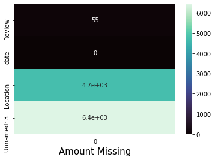
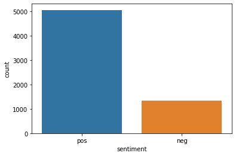
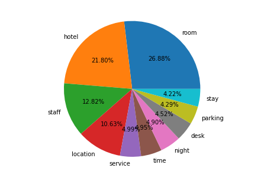
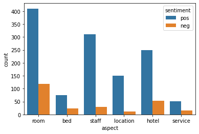
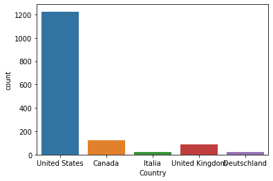

# Hotels Reviews Analysis

Lets see how the data looks


<table border="1" class="dataframe">
  <thead>
    <tr style="text-align: right;">
      <th></th>
      <th>Review</th>
      <th>date</th>
      <th>Location</th>
      <th>Unnamed: 3</th>
    </tr>
  </thead>
  <tbody>
    <tr>
      <th>0</th>
      <td>I was very impressed with the resort.\n Great ...</td>
      <td>2019-08-20</td>
      <td>Sebastian</td>
      <td>NaN</td>
    </tr>
    <tr>
      <th>1</th>
      <td>The rooms were nice the outside needs work als...</td>
      <td>2019-08-20</td>
      <td>Los Angeles</td>
      <td>NaN</td>
    </tr>
    <tr>
      <th>2</th>
      <td>Great location! I have stayed at this hotel on...</td>
      <td>2019-08-20</td>
      <td>Georgia</td>
      <td>NaN</td>
    </tr>
    <tr>
      <th>3</th>
      <td>The hotel was adequate for my stay. The strips...</td>
      <td>2019-08-20</td>
      <td>NaN</td>
      <td>NaN</td>
    </tr>
    <tr>
      <th>4</th>
      <td>Great location, room was large and spacious. P...</td>
      <td>2019-08-19</td>
      <td>Palm Harbor</td>
      <td>NaN</td>
    </tr>
  </tbody>
</table>


```python

```


​    

​    


Checking Null Values in the data


```python

```


    Review          55
    date             0
    Location      4737
    Unnamed: 3    6448
    dtype: int64


After Cleaning the data, The reviews look like this, free from punctuations and unnecessary strings.


```python

```


    0    I was very impressed with the resort Great sta...
    1    The rooms were nice the outside needs work als...
    2    Great location I have stayed at this hotel on ...
    3    The hotel was adequate for my stay The strips ...
    4    Great location room was large and spacious Par...
    Name: Review, dtype: object


### Sentiment Analysis on all reviews
We can see here that around 5000 reviews are positive and around 1300 reviews are negative 


```python

```


    <AxesSubplot:xlabel='sentiment', ylabel='count'>


​    

​    


### Term Frequency Analysis
The most Frequent Words in the reviews are:
* Room
* Hotel
* staff
* location
* service
* time
* night
* desk
* parking
* stay


```python

```


​    

​    


### Aspect Mining
after using aspect mining techniques, these aspect were the most important and most reviewed about!


```python

```


                1889
    room         528
    staff        341
    hotel        302
    location     161
    bed           98
    service       67
    place         62
    property      62
    area          55
    Name: aspect, dtype: int64


### Applying Aspect Based Sentiment Analysis
* The results shows the hotels aspects scores
* we found out that there are more positive reviews than negative in each aspect


    <AxesSubplot:xlabel='aspect', ylabel='count'>


​    

​    


### Word Cloud of Most Frequent Words


```python

```


​    

​    


### Feature Engineering 
* Added a Country column to the data which is feature engineered from the location 


```python
df2.head()
```


<table border="1" class="dataframe">
  <thead>
    <tr style="text-align: right;">
      <th></th>
      <th>Review</th>
      <th>date</th>
      <th>Location</th>
      <th>Country</th>
    </tr>
  </thead>
  <tbody>
    <tr>
      <th>0</th>
      <td>I was very impressed with the resort.\n Great ...</td>
      <td>2019-08-20</td>
      <td>Sebastian</td>
      <td>United States</td>
    </tr>
    <tr>
      <th>1</th>
      <td>The rooms were nice the outside needs work als...</td>
      <td>2019-08-20</td>
      <td>Los Angeles</td>
      <td>United States</td>
    </tr>
    <tr>
      <th>2</th>
      <td>Great location! I have stayed at this hotel on...</td>
      <td>2019-08-20</td>
      <td>Georgia</td>
      <td>United States</td>
    </tr>
    <tr>
      <th>4</th>
      <td>Great location, room was large and spacious. P...</td>
      <td>2019-08-19</td>
      <td>Palm Harbor</td>
      <td>United States</td>
    </tr>
    <tr>
      <th>10</th>
      <td>Very clean and friendly and I love the locatio...</td>
      <td>2019-08-19</td>
      <td>California</td>
      <td>United States</td>
    </tr>
  </tbody>
</table>


Top 5 countries who most reviewed


```python
sns.countplot(x='Country',data=new_df2)
```


    <AxesSubplot:xlabel='Country', ylabel='count'>


​    

​    


```python

```
